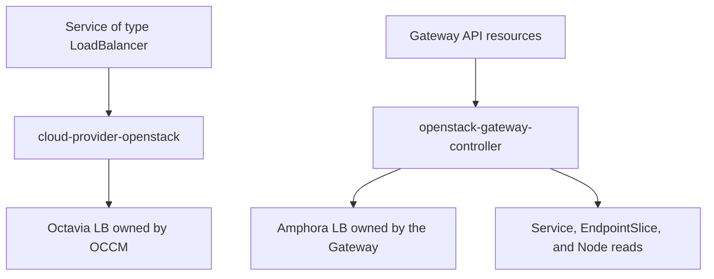

# Gateway API for OpenStack

> [!IMPORTANT]
> This project is pre-alpha and is not ready for production. Phase 1 is
> implemented, and Phase 2 focuses on reliability. The project has not yet
> published results from end-to-end controller testing in an OpenStack
> environment. The Phase 0 capability probe does not provide that coverage.

gateway-api-openstack is an experimental Kubernetes [Gateway API](https://gateway-api.sigs.k8s.io/)
implementation that currently supports a limited set of HTTP features. Its goal
is reliable HTTP and terminated HTTPS support on Octavia's Amphora provider.

The controller uses Octavia directly and supports only the Amphora provider. It
reconciles GatewayClass, Gateway, and HTTPRoute resources into Octavia load
balancers, listeners, pools, members, health monitors, and related Neutron
resources. It does this without taking ownership of
Service resources or load balancers managed by
[cloud-provider-openstack](https://github.com/kubernetes/cloud-provider-openstack).

## Why this project?

OpenStack clusters already have established integrations for Kubernetes
Services and proxy controllers that run inside the cluster. This controller
covers a different use case:

- cloud-provider-openstack provisions Octavia load balancers for Services of
  type `LoadBalancer`.
- Proxy controllers such as Traefik implement Gateway API inside the cluster.
- gateway-api-openstack creates Octavia resources directly for the HTTP features
  it currently supports. Terminated HTTPS and broader L7 support are planned.

The controller does not reuse or modify load balancers created by
cloud-provider-openstack.

## Architecture



The controller:

- Provisions new resources only for Gateway API objects assigned to its exact
  controller name. Previously bound objects remain its cleanup responsibility.
- Reads backend Service, EndpointSlice, and Node resources for the
  current NodePort path.
- Loads credentials from a projected Kubernetes Secret.
- Creates OpenStack resources only for Gateways managed by this controller.
- Never adopts, mutates, or deletes a load balancer owned by OCCM.
- Records the project, cluster, controller, Gateway UID, and resource role for
  every resource it creates. Resources created for an HTTPRoute also record the
  route identity. The controller manages a resource type only when it can store
  enough identity for safe recovery.

See [the architecture document](docs/design/architecture.md) for the proposed
resource mapping and ownership contract.

## Product direction

The goal is to make common HTTP and terminated HTTPS Gateway setups reliable
on Amphora. Planned work covers multiple Gateways, listeners, routes,
namespaces, backends, certificates, and Floating IPs. It also includes network
selection and security group automation in tested OpenStack topologies.
Supporting every Octavia provider is not a goal.

One controller deployment uses one OpenStack cloud, region, project, and
credential scope. One Gateway owns one Octavia load balancer. The controller
uses NodePort backends by default. Support for routable Pod IP members may be
added later as an opt-in after testing in documented network topologies.
Features that the Octavia API cannot express with Gateway API semantics are
rejected clearly rather than approximated.

Traefik, Envoy, and other proxy controllers remain independent projects and
deployment paths. This controller does not install or manage them.

## Current implementation

The controller currently supports:

- GatewayClass, Gateway, and HTTPRoute
- HTTP listeners
- one exact hostname, with either an Exact path match or a PathPrefix match on
  complete path elements
- one selected HTTPRoute in the same namespace as the Gateway, with one rule
  and one NodePort Service backend in the same namespace as the route
- NodePort members discovered from ready Nodes and EndpointSlices
- one Octavia load balancer per Gateway
- Octavia listeners, L7 policies and rules, pools, members, and health monitors
- Floating IP allocation
- standard Gateway API status conditions
- validation of the installed Gateway API v1.6.1 CRD bundle through the
  GatewayClass `SupportedVersion` condition
- the Amphora provider in Octavia as the only accepted provider

The first release will not claim Gateway API conformance. Amphora
capabilities still vary by Octavia version, enabled services, API
microversions, project permissions, and network topology. Some Gateway API
HTTP features cannot be represented by Octavia L7 policies. Unsupported
features must be rejected explicitly in resource status rather than ignored.

## Non-goals

- Replacing cloud-provider-openstack.
- Reimplementing the Kubernetes Service controller.
- Owning or migrating existing OCCM load balancers.
- Supporting OVN or another Octavia provider.
- Creating or owning tenant networks, subnets, routers, and routes.
- Reconciling Ingress, non-HTTP route kinds, or a proxy data plane.
- Hiding differences between Amphora environments or Octavia versions.
- Claiming that success in one OpenStack cloud proves compatibility with every
  OpenStack deployment.

## Project status

Current milestone: **Phase 2 — safe and efficient reconciliation**.

The Phase 0 probe tested the required Octavia and Neutron operations in one
environment. That result applies only to that environment. It does not show
that the controller works end to end or that every OpenStack cloud is
compatible.

The Phase 1 code is complete, although verification in an OpenStack environment
is still pending. Phase 2 focuses on these tasks:

1. Coordinate all mutations to a Gateway's OpenStack resource graph in one
   place.
2. Replace long Octavia waits and broad Kubernetes list scans with bounded,
   event-driven reconciliation.
3. Test restart, recovery after partial creation, no-op reconciliation, drift,
   and deletion with full ownership checks.
4. Publish the first end-to-end NodePort test result from an Amphora environment
   and a report of the remaining Gateway API conformance gaps.

See [ROADMAP.md](ROADMAP.md) for the complete phased plan.

## Getting started

The repository includes a minimal Kustomize deployment and a constrained
NodePort example for development environments. It requires a controller image
built by the operator and a Kubernetes Secret containing `clouds.yaml`. No
supported image is published yet.

See [Getting started with the current controller](docs/getting-started.md) for
prerequisites, configuration, installation, verification, limitations, and the
safe removal order. The repository also includes an experimental, read-only
ownership audit for comparing stored bindings with OpenStack resources. Do not
remove a controller finalizer. If finalization is blocked, keep the controller
and its credentials available and follow the
[operator recovery guide](docs/operator-recovery.md).

## Community direction

This project is currently an independently maintained, experimental
open source project.

The project has these long-term goals:

- Publish conformance results for a Gateway API version only after every
  claimed feature passes the pinned suite.
- Apply to the Gateway API implementation list only after submitting the
  required conformance report for the supported version.
- Build a diverse group of users, contributors, and maintainers.
- Consider a long-term community home only after the project has sustained
  adoption and contributor interest.

These are future goals. The project is independently maintained and is not
currently affiliated with or endorsed by the Kubernetes project, SIG Network,
the Gateway API project, the OpenInfra Foundation, or the
cloud-provider-openstack project.

## Contributing

Design feedback, Amphora environment reports, and implementation contributions
are welcome. Writing a full contribution guide is a Phase 2 task. Until then,
open a focused issue or look for issues marked `help wanted`.

Until the first architecture decision records are accepted, substantial API or
controller changes should begin as a design issue.

Changes to controller patching, finalizers, or cache indexes should also run:

```sh
make envtest-assets
make test-envtest
```

The first command downloads pinned Kubernetes 1.36.2 control plane binaries.
The test loads the Gateway API v1.6.1 Standard CRDs and does not need Kind, a
kubeconfig, or OpenStack access. It is not an OpenStack end-to-end test or
Gateway API conformance evidence.

Maintainers preparing a release must follow the
[draft release and artifact verification process](docs/releasing.md). Release
packaging does not replace the OpenStack and conformance evidence required by
the roadmap.

## Security

Please do not report vulnerabilities in a public issue. Follow
[SECURITY.md](SECURITY.md).

## License

Licensed under the [Apache License 2.0](LICENSE).
