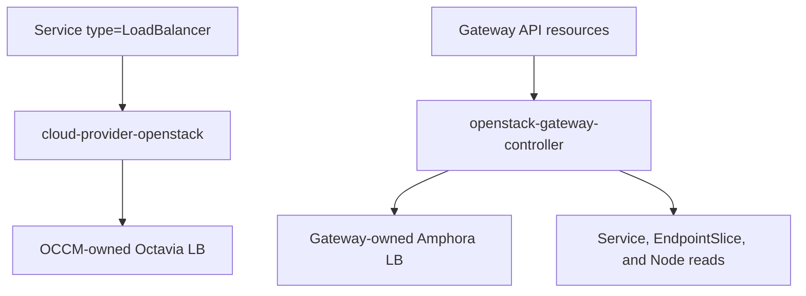

# Gateway API for OpenStack

> [!IMPORTANT]
> This project is in pre-alpha. The constrained Phase 1 implementation is
> complete and Phase 2 reliability work is active, but no production release
> is available yet.
>
> The repository contains an early controller and deployment manifests, but
> the complete controller path has not yet passed a real-cloud end-to-end test
> with published evidence. The Phase 0 capability probe is not controller E2E
> proof.
>
> Do not use this project in production.

gateway-api-openstack is an experimental Kubernetes [Gateway API](https://gateway-api.sigs.k8s.io/)
implementation that currently provides a constrained HTTP slice and targets a
production-grade HTTP and terminated HTTPS data path backed exclusively by
Octavia's Amphora provider.

The project is an Octavia-native, Amphora-only controller. It reconciles
`GatewayClass`, `Gateway`, and `HTTPRoute` resources into Octavia load
balancers, listeners, pools, members, health monitors, and related Neutron
resources. It does this without taking ownership of
`Service` resources or load balancers managed by
[cloud-provider-openstack](https://github.com/kubernetes/cloud-provider-openstack).

## Why this project?

OpenStack clusters have two established integration paths and a third use case
this project addresses:

- cloud-provider-openstack provisions Octavia load balancers for
  `Service type=LoadBalancer`
- proxy controllers such as Traefik implement Gateway API inside the cluster
- this project provides a direct mapping from Gateway resources to Octavia
  Amphora's cloud-native HTTP, HTTPS, and L7 load-balancing capabilities.

This project aims to close the third gap while retaining a clean ownership
boundary with existing cloud-provider components.

## Architecture

The controller:

- provisions new resources only for Gateway API objects assigned to its exact
  controller name; previously bound objects remain its cleanup responsibility
- reads backend `Service`, `EndpointSlice`, and `Node` resources for the
  current NodePort path
- loads credentials from a projected Kubernetes Secret
- **creates only Gateway-owned OpenStack resources**
- never adopts, mutates, or deletes an OCCM-owned load balancer
- records the complete immutable project, cluster, controller, Gateway UID,
  and resource-role identity where the OpenStack API supports metadata or
  tags, and does not manage a resource type without identity-safe recovery.

See [the architecture document](docs/design/architecture.md) for the proposed
resource mapping and ownership contract.

## Product direction

The target is a production-grade controller for the Amphora HTTP/HTTPS path,
not a framework for every Octavia provider. Within that boundary it should
make common Gateway API use straightforward: multiple Gateways, listeners,
routes, namespaces, backends, certificates, Floating IPs, and safe network and
security configuration across explicitly tested OpenStack topologies.

One controller deployment uses one OpenStack cloud, region, project, and
credential scope. One `Gateway` owns one Octavia load balancer. NodePort is the
default backend path; routable Pod IP members may be added only as a tested
opt-in. Features that the Octavia API cannot express with Gateway API semantics
are rejected clearly rather than approximated.

Traefik, Envoy, and other proxy controllers remain independent projects and
deployment paths. This controller does not install or manage them.

## Current implementation

The current native vertical slice includes:

- `GatewayClass`, `Gateway`, and `HTTPRoute`
- HTTP listeners
- one exact hostname and Exact or element-aware PathPrefix matching
- one selected same-namespace HTTPRoute per Gateway, with one rule and one
  same-namespace NodePort Service backend
- NodePort members discovered from ready Nodes and EndpointSlices
- one Octavia load balancer per Gateway
- Octavia listeners, L7 policies and rules, pools, members, and health monitors
- Floating IP allocation
- standard Gateway API status conditions
- the Amphora provider in Octavia as the only accepted provider

The first release will not claim full Gateway API conformance. Amphora
capabilities still vary by Octavia version, enabled services, API
microversions, project permissions, and network topology. Some Gateway API
HTTP features cannot be represented by Octavia L7 policies. Unsupported
features must be rejected explicitly in resource status rather than ignored.

## Non-goals

- Replacing cloud-provider-openstack.
- Reimplementing the Kubernetes Service controller.
- Owning or migrating existing OCCM load balancers.
- Supporting OVN or another Octavia provider.
- Creating or owning tenant networks, subnets, routers, and routes.
- Reconciling Ingress, non-HTTP route kinds, or a proxy data plane.
- Hiding Amphora environment and Octavia-version capability differences.
- Claiming that success in one OpenStack cloud proves compatibility with every
  OpenStack deployment.

## Project status

Current milestone: **Phase 2 — safe and efficient reconciliation**.

The Phase 0 capability probe has exercised the required Octavia and Neutron
resource primitives in one environment. That result is environment-specific
and does not establish that the Kubernetes controller is end-to-end ready or
that every OpenStack cloud is compatible.

The Phase 1 source baseline is complete. Phase 2 work is focused on:

1. making the Gateway the single coordinated OpenStack graph and eliminating
   overlapping mutations.
2. replacing long Octavia waits and broad Kubernetes list scans with bounded,
   event-driven reconciliation.
3. proving restart, partial-create, no-op, drift, and identity-safe deletion
   behavior.
4. publishing the first Amphora-backed NodePort controller E2E result and a
   Gateway API conformance gap report.

See [ROADMAP.md](ROADMAP.md) for the complete phased plan.

## Getting started

The repository includes a minimal Kustomize deployment and a constrained
NodePort example for development environments. It requires an operator-built
controller image and a Kubernetes Secret containing `clouds.yaml`; no supported
image is published yet.

See [Getting started with the current controller](docs/getting-started.md) for
prerequisites, configuration, installation, verification, limitations, and the
safe removal order.

## Community direction

This project is currently an independently maintained, experimental
open source project.

Its long-term goals are to:

- publish evidence-backed Gateway API conformance for the Amphora HTTP/HTTPS
  surface it actually supports;
- join the Gateway API implementation list after submitting the required
  version-specific conformance report;
- build a diverse group of users, contributors, and maintainers; and
- explore an appropriate long-term community home if the project demonstrates
  sustained adoption and contributor interest.

These are project goals, not commitments or claims of upstream acceptance.

This project is not currently affiliated with or endorsed by the Kubernetes
project, SIG Network, the Gateway API project, the OpenInfra Foundation,
or the cloud-provider-openstack project.

## Contributing

Design feedback, Amphora environment reports, and implementation contributions
are welcome. A full contribution guide is part of the Phase 2 project-baseline
work. Until it is published, start with a focused issue and the work marked
`help wanted`.

Until the first architecture decision records are accepted, substantial API or
controller changes should begin as a design issue.

Maintainers preparing a release must follow the
[draft release and artifact verification process](docs/releasing.md). Release
packaging does not replace the real-cloud and conformance evidence required by
the roadmap.

## Security

Please do not report vulnerabilities in a public issue. Follow
[SECURITY.md](SECURITY.md).

## License

Licensed under the [Apache License 2.0](LICENSE).
