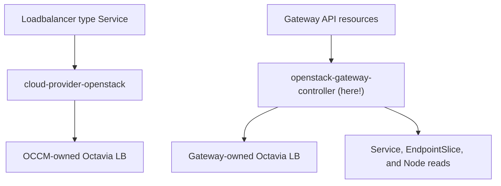

# Gateway API for OpenStack

> [!IMPORTANT]
> This project is in pre-alpha. Phase 1 controller implementation is in
> progress and no production release is available yet.
>
> The repository contains an early controller and deployment manifests, but
> the complete controller path has not yet passed a published real-cloud
> end-to-end suite. The Phase 0 capability probe is not controller E2E proof.
>
> Do not use this project in production.

gateway-api-openstack is an experimental Kubernetes [Gateway API](https://gateway-api.sigs.k8s.io/)
implementation backed by OpenStack Octavia.

The project is centered on an Octavia-native controller. It reconciles
`GatewayClass`, `Gateway`, and `HTTPRoute` resources into Octavia load
balancers, listeners, pools, members, health monitors, and related Neutron
resources. It does this without taking ownership of
`Service` resources or load balancers managed by
[cloud-provider-openstack](https://github.com/kubernetes/cloud-provider-openstack).

## Why this project?

Kubernetes users on OpenStack currently have three separate concerns:

- cloud-provider-openstack provisions Octavia load balancers for
  `Service type=LoadBalancer`
- proxy controllers such as Traefik implement Gateway API inside the cluster
- Octavia exposes cloud-native L4 and selected L7 load-balancing capabilities,
  but there is no independent Gateway API controller that maps Gateway
  resources directly to those capabilities.

This project aims to close the third gap while retaining a clean ownership
boundary with existing cloud-provider components.

## Architecture

The controller:

- watches only Gateway API resources assigned to its controller name
- reads backend `Service`, `EndpointSlice`, and `Node` resources for the Phase 1
  NodePort path, credentials are projected from a Kubernetes Secret
- **creates only Gateway-owned OpenStack resources**
- never adopts, mutates, or deletes an OCCM-owned load balancer
- records an immutable Kubernetes object UID and controller identity on every
  OpenStack resource where the API supports metadata or tags.

See [the architecture document](docs/design/architecture.md) for the proposed
resource mapping and ownership contract.

## Deployment paths

| Path | Gateway controller | Data plane | Purpose |
| --- | --- | --- | --- |
| Octavia native | This project | Octavia | Primary implementation, independent of the OCCM Service controller |
| Traefik reference profile | Traefik | Traefik behind an OpenStack L4 load balancer | Adopter-driven future work |
| Envoy reference profile | Not yet planned | Envoy | Adopter-driven future work |

These are separate deployment paths. The native controller does not manage
Traefik or Envoy, and the proxy-backed profiles do not share ownership of
occm loadbalancer controller(L4).

## Initial scope

The first native vertical slice targets:

- the Gateway controller profile
- `GatewayClass`, `Gateway`, and `HTTPRoute`
- HTTP listeners
- hostname, exact-path, and path-prefix matching
- one HTTPRoute per Gateway, with one rule and one Service backend
- NodePort members discovered from ready Nodes and EndpointSlices
- one Octavia load balancer per Gateway
- Octavia listeners, L7 policies and rules, pools, members, and health monitors
- Floating IP allocation
- standard Gateway API status conditions
- the Octavia Amphora provider as the first tested provider

The first release will not claim full Gateway API conformance. Octavia provider
capabilities vary, and some Gateway API HTTP features cannot be represented by
Octavia L7 policies. Unsupported features must be rejected explicitly in
resource status rather than ignored.

## Non-goals

- Replacing cloud-provider-openstack.
- Reimplementing the Kubernetes Service controller.
- Owning or migrating existing OCCM load balancers.
- Hiding provider capability differences.
- Supporting Traefik and Envoy inside the native reconciliation loop.
- Claiming that success in one OpenStack cloud proves compatibility with every
  OpenStack deployment.

## Project status

Current milestone: **Phase 1 — HTTP MVP implementation**.

The Phase 0 capability probe has exercised the required Octavia and Neutron
resource primitives in one environment. That result is environment-specific
and does not establish that the Kubernetes controller is end-to-end ready or
that every OpenStack cloud is compatible.

Current Phase 1 work is focused on:

1. completing and testing the `GatewayClass`, `Gateway`, and `HTTPRoute`
   reconciliation paths.
2. validating identity-safe deletion and restart behavior.
3. exercising the controller end to end with an Amphora-backed NodePort
   Service.
4. documenting the exact tested environment and remaining conformance gaps.

See [ROADMAP.md](ROADMAP.md) for the complete phased plan.

## Getting started

The repository includes a minimal Kustomize deployment and a constrained
NodePort example for development environments. It requires an operator-built
controller image and a Kubernetes Secret containing `clouds.yaml`; no supported
image is published yet.

See [Getting started with the Phase 1 controller](docs/getting-started.md) for
prerequisites, configuration, installation, verification, limitations, and the
safe removal order.

## Community direction

This project is currently an independently maintained, experimental
open source project.

Its long-term goals are to:

- implement a conformant Gateway API controller backed by OpenStack Octavia
- be listed as a Gateway API implementation after meeting the relevant requirements
- build a diverse group of users, contributors, and maintainers and
- explore an appropriate long-term community home if the project demonstrates
  sustained adoption and contributor interest.

These are project goals, not commitments or claims of upstream acceptance.

This project is not currently affiliated with or endorsed by the Kubernetes
project, SIG Network, the Gateway API project, the OpenInfra Foundation,
or the cloud-provider-openstack project.

## Contributing

Design feedback, OpenStack provider reports, and implementation contributions
are welcome. Start with CONTRIBUTING.md(will be open soon) and the issues marked
`help wanted`.

Until the first architecture decision records are accepted, substantial API or
controller changes should begin as a design issue.

Maintainers preparing a release must follow the
[draft release and artifact verification process](docs/releasing.md). Release
packaging does not replace the real-cloud and conformance evidence required by
the roadmap.

## Security

Please do not report vulnerabilities in a public issue. Follow
[SECURITY.md](SECURITY.md).

## License

Licensed under the [Apache License 2.0](LICENSE).

## Disclaimer

This is an independent community project. It is not currently an official
project of OpenInfra, OpenStack, Kubernetes, StackHPC, or their respective
foundations or organizations.
