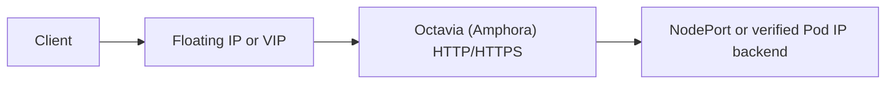

# Architecture

Status: proposed

Audience: contributors, reviewers, OpenStack operators, Gateway API implementers

## Problem statement

Kubernetes clusters on OpenStack need a Gateway API implementation that can
provision an HTTP and HTTPS data path backed directly by Octavia without tying
Gateway lifecycle to the cloud-provider-openstack Service controller or
requiring an in-cluster proxy.

gateway-api-openstack is designed only for Octavia's Amphora provider. It
translates Kubernetes Gateway API intent into Octavia, Neutron, and Barbican
resources. It does not try to support every Octavia provider or Gateway API
feature.

## Product contract

- Users configure the controller through Gateway API resources.
- Octavia's Amphora provider is the only load balancing data plane.
- One Gateway owns one Octavia load balancer and all of its dependent
  resources.
- HTTP and terminated HTTPS are in scope.
- By default, Amphora reaches backends through NodePorts. Pod IP may be enabled
  later only when topology checks prove that Amphora can reach Pod addresses.
- One controller deployment uses one OpenStack cloud, region, project, and
  credential scope.
- The controller coexists with cloud-provider-openstack but never shares a
  load balancer graph with it.
- Existing OpenStack resources are not adopted into controller ownership.
- Behavior that the public Octavia API cannot represent exactly is rejected in
  status.
- The controller does not manage Traefik, Envoy, Ingress, other Octavia
  providers, or Gateway API route kinds other than HTTPRoute.

This design lets users configure multiple Gateways, listeners, routes,
namespaces, backends, and certificates through standard Gateway API resources
on tested OpenStack topologies.

## Design principles

1. **Gateway API is the contract.** Standard resources, status conditions,
   feature discovery, and conformance tests for the supported version drive
   behavior.
2. **The controller supports only Amphora.** A provider field is not an
   extension point. Environment capability still varies with Octavia version,
   microversion, enabled services, project permissions, and topology.
3. **Ownership is exclusive.** No cloud resource graph may be reconciled by
   both this project and the OpenStack Cloud Controller Manager (OCCM) or
   another controller.
4. **One Gateway has one desired graph.** Listener and route changes are
   compiled together before the graph is mutated.
5. **Reconciliation is idempotent.** Restart, retry, cache lag, and external
   deletion are expected events that reconciliation must handle.
6. **Deletion requires complete ownership checks.** A name, cached ID, or
   attached port is never sufficient authority to delete a cloud resource.
7. **Cloud mutations are minimal.** A converged reconciliation performs no
   OpenStack mutation.
8. **Advertised capabilities are tested.** Unsupported or untested behavior is
   reported, never guessed or silently approximated.
9. **OpenStack access uses Gophercloud.** Controller code does not shell out to
   the OpenStack CLI.

## Ownership contract

### cloud-provider-openstack owns

- cloud node lifecycle and other cloud controller manager responsibilities
- Kubernetes Services of type `LoadBalancer`
- every Octavia and Neutron resource created for those Services

### openstack-gateway-controller owns

- Gateway API objects whose `GatewayClass.spec.controllerName` exactly matches
  the configured controller name
- cleanup of an object that no longer selects the controller when a durable
  finalizer or binding proves that this controller previously managed it
- Octavia load balancers and their listeners, pools, members, health monitors,
  L7 policies, and L7 rules created for those Gateways
- Neutron Floating IPs it creates for a Gateway
- future security groups and rules it creates under an accepted architecture
  decision record (ADR)
- future Barbican secrets or containers it can identify and delete safely

Ownership of a Kubernetes object means ownership only of the controller's
finalizers, annotations, and status fields. It does not grant authority over
another controller's fields or status entries.

Selection by controller name authorizes new provisioning. A previously bound
object that stops selecting this controller does not authorize a new graph, but
cleanup remains its responsibility until it has validated the stored graph,
confirmed that the graph is absent, and removed its finalizer.

### openstack-gateway-controller may read

- Service, EndpointSlice, Secret, ReferenceGrant, and Node objects
  needed by a managed graph
- GatewayClass parameters and future backend policy resources
- OpenStack networks, subnets, routers, ports, security groups, quotas, and
  service capabilities
- provider configuration and credentials

Reading or resolving an object does not give this controller ownership of it.

### openstack-gateway-controller must never

- watch Services of type `LoadBalancer` as a provisioning source
- add, remove, or rely on OCCM finalizers
- create a Service of type `LoadBalancer` for the direct Octavia data path
- adopt an existing cloud resource because its name, address, or tags look
  familiar
- mutate or delete a cloud resource whose complete immutable identity cannot
  be proven
- replace an association with a foreign security group or modify a rule owned
  by another component
- create or delete tenant networks, subnets, routers, or routes as an implicit
  consequence of a Gateway
- install or manage a proxy controller as part of reconciliation

### Mutating shared fields requires a separate contract

Attaching a security group created by this controller to a worker Neutron port
still mutates a port owned by Cluster API Provider OpenStack (CAPO), another
controller, or the operator. It is not covered by ownership of the security
group.

Managed backend security therefore requires an accepted ADR and explicit
GatewayClass opt-in. The contract must preserve all foreign group IDs and add
or remove only the ID added by this controller. Before accepting a mapping from
a Node to a Neutron port, it must validate the project, Nova server UUID,
`device_owner`, `device_id`, selected fixed IP and subnet, and
`port_security_enabled`. Updates must include the observed Neutron revision
where the API supports it. If the port changed concurrently or its identity is
ambiguous, the controller must reject the mutation and observe the port again.
Until that contract exists, the controller may validate referenced connectivity
but must not alter worker ports.

## Resource graph

The following table distinguishes the current Phase 1 graph from the planned
HTTP/HTTPS target.

| Kubernetes intent | OpenStack representation | Availability and ownership |
| --- | --- | --- |
| GatewayClass | Controller selection and validated deployment defaults | Current |
| OpenStackGatewayClassConfig | Typed class topology and policy parameters | Planned `v1alpha1`, cluster-scoped after an ADR defines the API domain |
| Gateway | Octavia load balancer using the Amphora provider | Current. One per Gateway |
| Gateway address | Neutron Floating IP created by the controller, or Octavia VIP | Dynamic allocation is current. Requested addresses are planned |
| Gateway listeners | Octavia HTTP or `TERMINATED_HTTPS` listener graph | One HTTP listener is current. The compiler and HTTPS are planned |
| HTTPRoute attachment | Listener association, status, and desired fragment for the listener | Attachment is currently constrained. Multiple routes are planned |
| HTTPRoute rule and match | Ordered L7 policies and conjunctive L7 rules | Host and path matching are current. Further exact mappings are planned |
| Service backend | Octavia pool and default or `REDIRECT_TO_POOL` action | One backend is current. A broader rule graph is planned |
| Node or EndpointSlice address | Octavia member | NodePort is current. Pod IP is a later opt-in |
| Class or backend health policy | Octavia health monitor | Deployment defaults are current. Typed class and backend policy settings are planned |
| TLS Secret | Barbican secret or container created by the controller and referenced by the listener | Planned after an identity and rotation ADR |
| Frontend access policy | Listener security managed by Octavia, or referenced `vip_sg_ids` | Octavia management is current. Referenced mode is planned after the controller can verify API support |
| Backend access policy | Referenced security group, or Neutron security group and rules created by the controller | Planned. Attaching the group to a worker port requires an ADR for modifying a foreign port |

The controller does not model an Octavia provider choice in the class API. It
always requests and verifies Amphora.

## Immutable cloud identity

The controller proves ownership from these immutable values:

- authenticated OpenStack project ID
- stable cluster ID
- controller identity
- Gateway namespace, name, and UID
- resource role
- for resources created for a route, the HTTPRoute namespace, name, and UID

HTTPRoute identity distinguishes child resources inside the graph owned by the
Gateway. It does not make the route reconciler an independent writer or graph
owner.

The controller release version is trace metadata, not an immutable ownership
field. A normal upgrade must not turn a managed resource into a foreign one.

Before executing a mutation plan, the controller validates the complete
identity and surrounding graph. Names, cached IDs, annotations, descriptions,
and tags help discover candidates but do not prove ownership on their own.
Duplicate candidates or an identity mismatch produce an ownership conflict and
stop mutation.

The controller may record OpenStack IDs in Kubernetes metadata to speed
recovery, but it must still discover resources by immutable identity within the
authenticated project. If an API such as Barbican cannot expose enough identity
for safe discovery and deletion, the resource type remains unsupported until a
safe mechanism has been designed and tested.

## Reconciliation model

The controller follows:

```text
observe -> build desired graph -> validate -> diff -> mutate -> observe
```

Each reconciliation collects the Kubernetes inputs and OpenStack state needed
to build and validate the graph. Validation of Gateway API semantics,
references, capabilities, and cloud ownership completes before the first cloud
mutation. Desired graphs and mutation order are stable across map iteration and
process restart.

The desired administrative state for a managed load balancer and listener is
enabled. A direct change to either field is drift because it prevents the
Gateway from serving traffic. When no route resources exist, Gateway
reconciliation can restore these fields after checking the complete Gateway
graph. When a route graph exists, Gateway reconciliation leaves the load
balancer or listener disabled because it cannot identify the HTTPRoute that
owns those resources. The already bound HTTPRoute performs the repair after it
has checked the exact Route identity, the complete Route graph, the Amphora
provider, VIP subnet, listener port, and Floating IP configuration. It enables
the listener first and the load balancer on a later reconciliation. Changes to
the provider, subnet, protocol, port, external network, or identity are not
repaired. The controller reports them as ownership conflicts and stops
mutation.

Creation follows dependencies:

```text
LoadBalancer -> Listener -> Pool -> Member/HealthMonitor -> L7Policy -> L7Rule
```

Deletion validates the complete graph, then follows the reverse dependency
order. An owned resource that is already absent counts as successfully deleted.
An unvalidated cascade is forbidden.

### Graph writer for each Gateway

Changes to the desired graph are serialized by Gateway UID. In the current
implementation, Gateway and HTTPRoute reconcilers can both target the same load
balancer. Before multiple routes or concurrent workers
are enabled, one writer keyed by Gateway UID must compile and apply the complete
listener graph.

GatewayClass and HTTPRoute reconcilers can remain responsible for acceptance,
reference validation, and the status fields they own. Their fragments feed the
graph writer, but they must not issue OpenStack mutations independently.

A coordinator shared by the controller process and keyed by Gateway UID can
prevent two active workers from mutating the same graph at once. Correctness
still comes from the desired graph and OpenStack observation, so restart and
leader change require no lock recovery. Leader election is required for
multiple controller replicas.

### Asynchronous OpenStack operations

Octavia is asynchronous. Each reconciliation should make at most one state
transition, observe it for a bounded period, and return a jittered
`RequeueAfter` while progress continues. It must not hold a worker until an
operation that takes several minutes finishes.

No mutation is issued while the load balancer is `PENDING_*`. Request timeout,
retryable API failure, rate limiting, quota exhaustion, terminal validation,
Octavia `ERROR`, and ownership conflict are distinct outcomes. Timeouts and
retries are bounded, and a later reconciliation always observes the resource
again before acting.

### Efficient Kubernetes event handling

Manager setup indexes GatewayClass ownership, parent Gateway references,
backend Services, cleanup bindings, and the Service associated with each
EndpointSlice. Watch handlers use those indexes instead of listing every object
in the cluster. Node changes enqueue only affected managed NodePort backends.

Predicates may filter updates that change only status or are otherwise
irrelevant, but they must not hide a dependency transition needed for
correctness. The controller treats cached objects as immutable and makes a copy
before mutation. It uses an uncached `APIReader` only for a documented
read-after-write or safety requirement.

## Target controller responsibilities

These responsibilities describe the planned design. Phase 1 implements only
the constrained subset documented in the roadmap and
`docs/getting-started.md`.

### GatewayClass reconciler

- Select the exact controller name.
- Validate deployment defaults or the referenced class configuration.
- Check the Amphora environment's capabilities and permissions.
- Write `Accepted` and version support, and publish `supportedFeatures` only
  when conformance results support them.
- Prevent deletion while managed Gateways use the class.

### Gateway reconciler and graph writer

- Validate the class binding, addresses, and listeners.
- Collect attached route fragments.
- Compile the complete load balancer graph from cloud abstraction types rather
  than Gophercloud types.
- Reconcile the load balancer, address, listeners, and ordered route resources.
- Write Gateway and listener conditions and `attachedRoutes`.
- Finalize the graph only after validating its identity.

### HTTPRoute reconciler

- Evaluate parent attachment and `allowedRoutes`.
- Resolve Service references and future ReferenceGrant authorization.
- Validate matches, filters, and backends.
- Produce a deterministic desired fragment for each accepted parent.
- Write only this controller's parent status entries.
- Watch every Service, EndpointSlice, Node, grant, or future policy that can
  change the fragment.

Support for multiple routes needs an ADR that defines how route reconcilers pass
fragments to the graph writer.

## Backend connectivity

The class configuration must state how Amphora reaches backends. The controller
does not infer this from the installation.

### NodePort mode

NodePort is the default and the only current mode. Octavia members point to
selected worker Node addresses and a Service NodePort provided by the user. The
controller never creates a helper Service.

The controller validates the Service port, protocol, Node address, member
subnet, Node readiness, and EndpointSlice state.
`externalTrafficPolicy: Cluster` may use every eligible Node.
`externalTrafficPolicy: Local` uses only Nodes with eligible local endpoints
and therefore updates membership from EndpointSlice events.

NodePort works where Pod CIDRs are not routable from Amphora, but it requires
explicit routing and security rules that allow Amphora instances to reach
worker ports. Phase 4 reduces that operator work without taking ownership of
the cluster network.

### Pod IP mode

Support for Pod IP members may be added later as an experimental option. It
requires direct routing from the Amphora member network, CNI compatibility
evidence, correct handling of the EndpointSlice ready, serving, and terminating
conditions, safe draining, and an explicit security model. The controller must
reject the mode if it cannot verify those prerequisites. Pod IP support is not
required for the stable NodePort contract.

## Network, address, and security model

Network, subnet, and port names do not uniquely identify a resource. A
configured ID or selector must resolve to exactly one object visible in the
authenticated project before mutation. The controller records the result as an
immutable binding for the Gateway, so a later selector change does not silently
move an existing load balancer.

The controller may allocate a new Floating IP for a Gateway or publish the VIP
without one. A requested `Gateway.spec.addresses` IP means an Octavia VIP,
while class Floating IP policy controls the separate external address. The API
contract must define whether `Allocate` adds a FIP to a requested VIP or
rejects the combination. The controller never adopts an existing Floating IP.
Foreign addresses on the VIP port are an ownership conflict.

Frontend security defaults to Octavia management. Before using `vip_sg_ids`,
the controller verifies that the negotiated API supports it and validates
every reference. Status and documentation must state that Octavia will no
longer create listener ingress rules. This feature requires API microversion
2.29, introduced with Octavia 16.0 (OpenStack 2025.1), and applies the custom
groups to the VIP and Amphora VRRP ports. Octavia retains internal VRRP and
HAProxy peer rules, but custom groups are incompatible with listener
`allowed_cidrs` and SR-IOV
load balancers. The currently pinned Gophercloud version has no typed
`vip_sg_ids` create option, so this remains planned until the client path is
updated or narrowly extended and tested. The controller does not edit a
referenced group's rules.

Backend security initially relies on connectivity managed by the operator or
supplied by reference. A future managed mode may create a security group and
exact NodePort rules, but attaching the group to worker ports requires the
contract for changing `security_groups` described above. Backend source CIDRs
must come from explicit configuration or published environment evidence. The
controller must not assume that the VIP subnet is the Amphora egress source.

## HTTP and HTTPS compilation

Gateway API route matches are alternatives, and the conditions within a match
are conjunctive. Octavia policies are ordered alternatives, and the rules
within a policy are conjunctive. The compiler therefore expands each
representable match into a policy fragment and orders the full listener graph
according to Gateway API precedence.

PathPrefix requires special handling. Octavia `STARTS_WITH /foo` also matches
`/foobar`, while Gateway API PathPrefix does not. The representable mapping is
an exact `/foo` policy plus a `/foo/` prefix policy.

Octavia can directly represent exact and wildcard hostnames, Exact and
PathPrefix paths, and exact header matches; these are candidates for support.
Method and query matching, header transformation, URL rewrite, mirroring, and
other filters remain unsupported unless exact behavior is proven. Weighted
Service backends require separate proof because Octavia member weights do not
automatically preserve weights assigned to Services or the Gateway API behavior
required when a backend is invalid.

Full HTTPRoute Core support also requires the Kubernetes Service backend
behavior defined as Core by Gateway API, including ClusterIP Services, plus
`RequestHeaderModifier` and `RequestRedirect`. The current NodePort path rejects
ClusterIP Services, so it cannot advertise `HTTPRoute` in `supportedFeatures`
or claim full GATEWAY-HTTP conformance. Partial conformance is an acceptable
result when the unsupported Core behavior is explicit.

Terminated HTTPS uses Kubernetes TLS Secrets and future Barbican resources
created by the controller. Cross-namespace Secret access requires a
ReferenceGrant. Certificate identity, rotation, rollback, SNI grouping, and
deletion safety must be designed and tested before HTTPS is advertised.

`ReferenceGrant` is a union feature. The controller reports it in
`supportedFeatures` only after Service and Secret references and every
applicable feature combination pass the pinned conformance suite.

## Amphora environment capability model

The controller always uses Amphora, but available features vary between
environments. The controller determines support from:

- OpenStack and Octavia versions and the negotiated microversion
- Amphora features exposed by the public API
- enabled Octavia, Neutron, and optional Barbican services
- project roles, policies, quotas, and visible topology
- behavior proven by this project's tests in a documented OpenStack environment

Capabilities affect tags, L7 behavior, custom VIP security groups, health
monitors, TLS, and every Gateway API feature claim. A feature is unsupported
until its availability is known.

Capability discovery may reject a requested class feature, but it does not by
itself authorize `GatewayClass.status.supportedFeatures`. That field is a
runtime support declaration consumed by conformance tests and is published
only after the applicable feature combinations pass for the pinned version.

## Configuration layers

1. **Controller deployment:** credentials, cloud, region, authenticated
   project, stable cluster identity, controller identity, logging, metrics,
   throttling, and safe operational defaults.
2. **GatewayClass parameters:** a future cluster-scoped
   OpenStackGatewayClassConfig for VIP and member placement, Floating IP
   policy, Amphora flavor and availability zone, NodePort addressing, security
   modes, and class health defaults. Its `GatewayClass.spec.parametersRef`
   namespace is unset.
3. **Gateway API objects:** portable listener, address, attachment, route,
   backend, certificate, and `Gateway.spec.infrastructure` intent.
4. **Backend policy:** a future namespaced OpenStackBackendPolicy may be added
   when documented use cases require health monitor settings for individual
   Services. It will follow Direct Policy Attachment.

If introduced, that policy uses a Service `targetRef` in the same namespace,
supports a named Service port through `sectionName`, carries the
`gateway.networking.k8s.io/policy: Direct` CRD label, and reports standard
`Accepted`, `Conflicted`, and `TargetNotFound` reasons through
`PolicyAncestorStatus` entries for each Gateway and controller.

Credentials, project, region, and provider selection do not belong in the
class CRD. The API group requires a domain controlled by the project. Start with
OpenAPI and CEL validation. Add a webhook only when those mechanisms cannot
express a required rule.

GatewayClass is a template. The design must state whether and how parameter
changes propagate. An existing Gateway keeps its validated binding and requires
an explicit migration for infrastructure changes that could replace or move
cloud resources.

Gateway API also offers a namespaced
`Gateway.spec.infrastructure.parametersRef`. Use it instead of annotations if
documented use cases require OpenStack settings for individual Gateways, but add
no second configuration kind until an ADR defines which settings the operator
and application teams may control and how they merge with class defaults.
Until that contract is implemented, the controller rejects a Gateway
`parametersRef` explicitly rather than silently ignoring it.

## Failure, status, and recovery

- Standard Gateway API conditions and reasons are used whenever they exist.
- `ObservedGeneration` advances only for an evaluated generation.
- Unsupported configuration is terminal until an input event changes it.
- Dependency readiness relies on watches. External asynchronous progress uses
  bounded requeue intervals.
- Authentication, authorization, quota, rate limiting, timeout, pending,
  provider failure, and ownership conflict remain distinguishable.
- If a resource whose ownership has been verified is deleted externally,
  recreate it safely unless its Kubernetes owner is being deleted.
- A collision or incomplete identity is terminal and never triggers adoption.
- Status patches preserve other controllers' HTTPRoute parent entries and do
  nothing when the status has not changed semantically.
- Events and messages are useful to an operator without exposing credentials,
  certificates, private API bodies, or customer identifiers.

Finalization is idempotent, follows dependency order, and can resume after a
controller restart. The finalizer remains until the entire graph whose
ownership has been validated is absent. The controller never forcibly removes
a finalizer.

## Security and release model

- Prefer Keystone application credentials with only the permissions that the
  controller needs.
- Credentials are loaded from Secrets and never copied to status, Events, or
  public diagnostics.
- Kubernetes RBAC grants only the reads and writes required by the active
  feature set.
- Permission to modify worker ports owned by another component, permission to
  use custom VIP groups, and access to Barbican are separate privileges. Request
  each privilege only when the corresponding mode is enabled.
- Public fixtures and compatibility reports contain no credential, project,
  address, or customer data that should remain private.
- Images and charts for a production candidate release require reproducible
  builds, SBOMs, provenance, signatures, vulnerability scanning, and an
  immutable promotion process.

## Explicit data plane boundary

The controller manages only the direct path:



Traefik, Envoy, or another proxy can be deployed independently on OpenStack,
but this repository does not provide, install, or reconcile that path. Such a
proxy may use OCCM and a Service of type `LoadBalancer` without sharing this
controller's Gateway graph.

## Open design decisions

The following require public ADRs before their associated feature is declared
stable:

- canonical controller name, module ownership, and project API domain
- graph writer for each Gateway and ownership of route fragments
- GatewayClass parameter snapshot, migration, and deletion behavior
- whether individual Gateways need infrastructure parameters and, if so, their
  scope and merge semantics
- schema for network selectors and immutable binding representation
- whether managed backend security may attach a security group created by this
  controller to worker ports owned by another component
- identity and reference counting for shared security groups, and uninstall
  behavior
- source identity or CIDRs for security rules that allow traffic from Amphora
  members to backends
- listener grouping and global HTTPRoute precedence
- whether Octavia can reproduce Gateway API behavior for weighted or invalid
  backends
- Barbican identity, certificate rotation, and rollback
- Direct Policy Attachment and conflict rules for a backend policy
- topology and CNI requirements for Pod IP members

These decisions require an accepted ADR. Behavior observed in one environment
is not enough to define the project contract.
