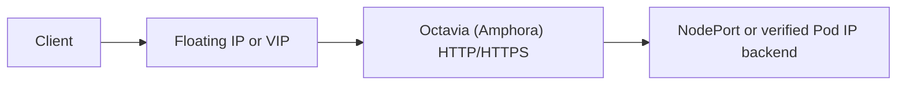

# Architecture

Status: proposed

Audience: contributors, reviewers, OpenStack operators, Gateway API implementers

## Problem statement

Kubernetes clusters on OpenStack need a Gateway API implementation that can
provision a cloud-native HTTP and HTTPS data path without tying Gateway
lifecycle to the cloud-provider-openstack Service controller or requiring an
in-cluster proxy.

gateway-api-openstack is deliberately narrower than a general Octavia
controller. It targets the Amphora provider and translates Kubernetes Gateway
API intent into Octavia, Neutron, and Barbican resources. The goal is a
predictable controller for the supported surface, not a compatibility layer
for every provider or every Gateway API feature.

## Product contract

- Gateway API is the northbound API.
- Octavia's Amphora provider is the only load-balancing data plane.
- One `Gateway` owns one Octavia load balancer and one coherent dependent
  graph.
- HTTP and terminated HTTPS are in scope.
- NodePort is the default backend path. Pod IP is a later, topology-gated
  opt-in.
- One controller deployment uses one OpenStack cloud, region, project, and
  credential scope.
- The controller coexists with cloud-provider-openstack but never shares a
  load balancer graph with it.
- Existing OpenStack resources are not adopted into controller ownership.
- Behavior that the public Octavia API cannot represent exactly is rejected in
  status.
- Traefik, Envoy, Ingress, non-Amphora providers, and non-HTTP route kinds are
  outside the native reconciliation path.

The intended user experience is broad within this boundary: multiple
Gateways, listeners, routes, namespaces, backends, certificates, and tested
OpenStack topologies should use normal Gateway API resources wherever the
semantics are portable.

## Design principles

1. **Gateway API is the contract.** Standard resources, status conditions,
   feature discovery, and version-specific conformance tests drive behavior.
2. **Amphora is a product boundary.** A provider field is not an extension
   point. Environment capability still varies with Octavia version,
   microversion, enabled services, project permissions, and topology.
3. **Ownership is exclusive.** No cloud resource graph may be reconciled by
   both this project and OCCM or another controller.
4. **One Gateway has one desired graph.** Listener and route changes are
   compiled together before the graph is mutated.
5. **Reconciliation is idempotent.** Restart, retry, cache lag, and external
   deletion are ordinary controller conditions.
6. **Deletion is identity-safe.** A name, cached ID, or attached port is never
   sufficient authority to delete a cloud resource.
7. **Cloud mutations are minimal.** A converged reconciliation performs no
   OpenStack mutation.
8. **Capabilities are evidence-backed.** Unsupported or untested behavior is
   reported, never guessed or silently approximated.
9. **OpenStack access uses Gophercloud.** Controller code does not shell out to
   the OpenStack CLI.

## Ownership contract

### cloud-provider-openstack owns

- cloud node lifecycle and other CCM responsibilities;
- Kubernetes `Service type=LoadBalancer`; and
- every Octavia and Neutron resource created for those Services.

### openstack-gateway-controller owns

- Gateway API objects whose `GatewayClass.spec.controllerName` exactly matches
  the configured controller name;
- cleanup of an object that no longer selects the controller when a durable
  finalizer or binding proves that this controller previously managed it;
- Octavia load balancers and their listeners, pools, members, health monitors,
  L7 policies, and L7 rules created for those Gateways;
- Neutron Floating IPs it creates for a Gateway;
- future security groups and rules it creates under an accepted ownership ADR;
  and
- future Barbican secrets or containers it can identify and delete safely.

Ownership of a Kubernetes object means ownership only of the controller's
finalizers, annotations, and status fields. It does not grant authority over
another controller's fields or status entries.

Controller-name selection authorizes new provisioning. A previously bound
object that stops selecting this controller does not authorize a new graph,
but it remains the controller's cleanup responsibility until its validated
stored graph is absent and the controller-owned finalizer can be removed.

### openstack-gateway-controller may read

- `Service`, `EndpointSlice`, `Secret`, `ReferenceGrant`, and `Node` objects
  needed by a managed graph;
- GatewayClass parameter and future backend policy resources;
- OpenStack networks, subnets, routers, ports, security groups, quotas, and
  service capabilities; and
- provider configuration and credentials.

Reading or resolving an object does not make that object controller-owned.

### openstack-gateway-controller must never

- watch `Service type=LoadBalancer` as a provisioning source;
- add, remove, or rely on OCCM finalizers;
- create a `LoadBalancer` Service for the native path;
- adopt an existing cloud resource because its name, address, or tags look
  familiar;
- mutate or delete a cloud resource whose complete immutable identity cannot
  be proven;
- replace a foreign security-group association or modify a foreign
  security-group rule;
- create or delete tenant networks, subnets, routers, or routes as an implicit
  consequence of a Gateway; or
- install or manage a proxy controller in the native loop.

### Shared-field mutations require a separate contract

Attaching a controller-created security group to a worker Neutron port still
mutates a port owned by CAPO, another controller, or the operator. It is not
covered by ownership of the security group.

Managed backend security therefore requires an accepted ADR and explicit
GatewayClass opt-in. The contract must preserve all foreign group IDs, add or
remove only the controller-owned ID, and validate the project, Nova server
UUID, `device_owner`, `device_id`, selected fixed IP and subnet, and
`port_security_enabled` before accepting a Node-to-port mapping. It must use
revision-aware writes where available and fail closed on a concurrent or
ambiguous update. Until that contract exists, the controller may validate
referenced connectivity but must not alter worker ports.

## Resource graph

The following table distinguishes the current Phase 1 graph from the planned
HTTP/HTTPS target.

| Kubernetes intent | OpenStack representation | Availability and ownership |
| --- | --- | --- |
| GatewayClass | Controller selection and validated deployment defaults | Current |
| `OpenStackGatewayClassConfig` | Typed class topology and policy parameters | Planned `v1alpha1`; cluster-scoped after API-domain ADR |
| Gateway | Octavia load balancer using the Amphora provider | Current; one per Gateway |
| Gateway address | Controller-owned Neutron Floating IP or Octavia VIP | Current dynamic allocation; requested addresses planned |
| Gateway listeners | Octavia HTTP or `TERMINATED_HTTPS` listener graph | One HTTP listener current; compiler and HTTPS planned |
| HTTPRoute attachment | Listener association, status, and listener-wide desired fragment | Current constrained attachment; multiple routes planned |
| HTTPRoute rule and match | Ordered L7 policies and conjunctive L7 rules | Host/path current; exact representable expansion planned |
| Service backend | Octavia pool and default or redirect-to-pool action | One backend current; broader rule graph planned |
| Node or EndpointSlice address | Octavia member | NodePort current; Pod IP later and opt-in |
| Class or backend health policy | Octavia health monitor | Deployment default current; typed class and optional backend policy planned |
| TLS Secret | Controller-owned Barbican secret/container and listener reference | Planned after identity and rotation ADR |
| Frontend access policy | Octavia-managed listener security or referenced `vip_sg_ids` | Octavia-managed current; referenced mode planned and capability-gated |
| Backend access policy | Referenced or controller-owned Neutron security group and rules | Planned; worker-port attachment requires shared-ownership ADR |

The controller does not model an Octavia provider choice in the class API. It
requests and verifies Amphora according to the fixed product contract.

## Immutable cloud identity

The immutable ownership anchor includes:

- authenticated OpenStack project ID;
- stable cluster ID;
- complete controller identity;
- Gateway namespace, name, and UID;
- resource role; and
- for the current route-scoped resources, HTTPRoute namespace, name, and UID.

HTTPRoute identity scopes child resources inside the Gateway-owned graph; it
does not make the route reconciler an independent writer or graph owner.

The controller release version is trace metadata, not an immutable ownership
field. A normal upgrade must not turn a managed resource into a foreign one.

Every coherent mutation plan validates the complete identity and surrounding
graph before its first create, update, or delete. Names, cached IDs,
annotations, descriptions, and tags are discovery aids rather than individual
proof. Duplicate candidates or a mismatch produce an ownership conflict and
stop mutation.

The controller may checkpoint OpenStack IDs in Kubernetes metadata for faster
recovery, but project-scoped identity discovery remains the source of truth.
If an API such as Barbican cannot expose enough identity for safe discovery
and deletion, that resource type remains unsupported until the gap has an
accepted design and tests.

## Reconciliation model

The controller follows:

```text
observe -> build desired graph -> validate -> diff -> mutate -> observe
```

The observed Kubernetes inputs must form a coherent snapshot. Validation of
Gateway API semantics, references, capabilities, and cloud ownership completes
before the first cloud mutation. Desired graphs and mutation order are stable
across map iteration and process restart.

Creation follows dependencies:

```text
LoadBalancer -> Listener -> Pool -> Member/HealthMonitor -> L7Policy -> L7Rule
```

Deletion validates the complete graph, then follows the reverse dependency
order. Already-absent owned resources are success; an unvalidated cascade is
forbidden.

### Gateway-scoped graph writer

The Gateway UID is the serialization key and the root of the desired graph.
In the current implementation, Gateway and HTTPRoute reconcilers can both
target the same load balancer. Before multiple routes or concurrent workers
are enabled, one Gateway-scoped writer must compile and apply the complete
listener graph.

GatewayClass and HTTPRoute reconcilers can remain responsible for acceptance,
reference validation, and their owned status. Their desired fragments are
inputs to the graph writer, not authority for overlapping, independently
ordered OpenStack mutations.

A process-local keyed coordinator can prevent two active workers from mutating
the same graph at once. Correctness still comes from the desired graph and
OpenStack observation so restart and leader change require no lock recovery.
Leader election is required for multiple controller replicas.

### Asynchronous OpenStack operations

Octavia is asynchronous. A reconcile should make at most one state transition,
perform a bounded observation, and return progress with jittered
`RequeueAfter`. It must not hold a worker until a multi-minute operation
finishes.

No mutation is issued while the load balancer is `PENDING_*`. Retryable API
failure, rate limiting, quota exhaustion, terminal validation, Octavia
`ERROR`, and ownership conflict are distinct outcomes. Timeouts and retries are
bounded, and a later reconciliation always re-observes before acting.

### Efficient Kubernetes event handling

Manager setup indexes GatewayClass ownership, normalized parent Gateways,
backend Services, cleanup bindings, and EndpointSlice-to-Service
relationships. Watch mapping uses those indexes rather than cluster-wide list
scans. Node changes fan out only to managed NodePort backends that can be
affected.

Status-only and irrelevant updates may be filtered, but no predicate may hide
a dependency transition needed for correctness. Cached objects are immutable;
the controller deep-copies before mutation and uses an uncached API reader only
for a documented read-after-write or safety requirement.

## Target controller responsibilities

These responsibilities describe the target architecture. Phase 1 implements
only the constrained subset documented in the roadmap and getting-started
guide.

### GatewayClass reconciler

- selects the exact controller name;
- validates deployment defaults or the referenced class configuration;
- performs Amphora-environment capability and permission preflight;
- writes `Accepted`, version support, and evidence-backed
  `supportedFeatures`; and
- prevents deletion while managed Gateways use the class.

### Gateway reconciler and graph writer

- validates class binding, addresses, and listeners;
- collects attached route fragments;
- compiles the complete provider-neutral load balancer graph;
- ensures the load balancer, address, listeners, and ordered route resources;
- writes Gateway and listener conditions and `attachedRoutes`; and
- performs identity-safe graph finalization.

### HTTPRoute reconciler

- evaluates parent attachment and `allowedRoutes`;
- resolves Service references and future `ReferenceGrant` authorization;
- validates matches, filters, and backends;
- produces a deterministic desired fragment for its accepted parents;
- writes only this controller's parent status entries; and
- watches every Service, EndpointSlice, Node, grant, or future policy that can
  change the fragment.

The exact handoff between route fragments and the graph writer is an ADR gate
for multi-route support.

## Backend connectivity

Backend reachability is part of the public class contract, not an installation
detail the controller guesses.

### NodePort mode

NodePort is the default and the only current mode. Octavia members point to
selected worker Node addresses and a user-provided Service NodePort. The
controller never creates a helper Service.

The controller validates the Service port, protocol, Node address, member
subnet, Node readiness, and EndpointSlice state. `externalTrafficPolicy:
Cluster` may use every eligible Node. `Local` uses only Nodes with eligible
local endpoints and therefore requires EndpointSlice-driven membership.

NodePort works where Pod CIDRs are not routable from Amphora, but it requires
explicit routing and security access from the Amphora member side to worker
ports. Phase 4 reduces that operator work without taking ownership of the
cluster network.

### Pod IP mode

Pod IP members are a later experimental opt-in. They require direct routing
from the Amphora member network, CNI-specific evidence, correct EndpointSlice
ready/serving/terminating handling, draining behavior, and an explicit security
model. The controller must reject the mode if those prerequisites cannot be
verified. Pod IP support is not required for the stable NodePort contract.

## Network, address, and security model

Network, subnet, and port names are not unique identity. A configured ID or
selector must resolve to exactly one project-visible object before mutation.
The resulting immutable binding anchors the Gateway; a later selector change
does not silently move an existing load balancer.

The controller may allocate a new Floating IP for a Gateway or publish the VIP
without one. A requested `Gateway.spec.addresses` IP means an Octavia VIP,
while class Floating IP policy controls the separate external address. The API
contract must define whether `Allocate` adds a FIP to a requested VIP or
rejects the combination. The controller never adopts an existing Floating IP.
Foreign addresses on the VIP port are an ownership conflict.

Frontend security defaults to Octavia management. When a class selects
referenced custom VIP groups, the controller capability-gates `vip_sg_ids`,
validates the references, and makes clear that Octavia no longer creates
listener ingress rules. This feature requires API microversion 2.29, introduced
with Octavia 16.0 (OpenStack 2025.1), and applies the custom groups to the VIP
and Amphora VRRP ports. Octavia retains internal VRRP and HAProxy peer rules,
but custom groups are incompatible with listener `allowed_cidrs` and SR-IOV
load balancers. The currently pinned Gophercloud version has no typed
`vip_sg_ids` create option, so this remains planned until the client path is
updated or narrowly extended and tested. The controller does not edit a
referenced group's rules.

Backend security begins with operator-managed or referenced connectivity.
Future managed mode may create a controller-owned group and exact NodePort
rules, but attaching it to worker ports requires the shared-field contract
described above. Backend source CIDRs come from explicit configuration or
published environment evidence, never an assumption that the VIP subnet is the
Amphora egress source.

## HTTP and HTTPS compilation

Gateway API route matches are alternatives; the conditions within a match are
conjunctive. Octavia policies are ordered alternatives and the rules within a
policy are conjunctive. The compiler therefore expands each representable
match into a policy fragment and orders the full listener graph according to
Gateway API precedence.

PathPrefix requires special handling. Octavia `STARTS_WITH /foo` also matches
`/foobar`, while Gateway API PathPrefix does not. The representable mapping is
an exact `/foo` policy plus a `/foo/` prefix policy.

Only public Octavia operations with equivalent semantics are used. Exact
hostname, wildcard hostname, Exact and PathPrefix paths, and exact headers are
candidate native matches. Method and query matching, header transformation,
URL rewrite, mirroring, and other filters remain unsupported unless exact
behavior is proven. Weighted Service backends require separate proof because
Octavia member weights do not automatically preserve Service-level weight and
invalid-backend semantics.

Full HTTPRoute Core support also requires every non-`ExternalName` Kubernetes
Service backend shape covered by Gateway API, `RequestHeaderModifier`, and
`RequestRedirect`. The current NodePort-only path rejects ClusterIP Services,
so it cannot advertise `HTTPRoute` in `supportedFeatures` or claim full
GATEWAY-HTTP conformance. Partial conformance is an acceptable result when the
unsupported Core behavior is explicit.

Terminated HTTPS uses Kubernetes TLS Secrets and future controller-owned
Barbican resources. Cross-namespace Secret access requires a ReferenceGrant.
Certificate identity, rotation, rollback, SNI grouping, and deletion safety
must be designed and tested before HTTPS is advertised.

`ReferenceGrant` is a union feature. The controller reports it in
`supportedFeatures` only after Service and Secret references, and every
applicable combination with the other reported features, pass the pinned
conformance suite.

## Amphora environment capability model

Amphora is fixed, but Amphora environments are not uniform. Effective
capability is the intersection of:

- OpenStack and Octavia versions and negotiated microversion;
- Amphora features exposed by the public API;
- enabled Octavia, Neutron, and optional Barbican services;
- project roles, policies, quotas, and visible topology; and
- behavior proven by this project's tests in a named environment profile.

Capabilities affect tags, L7 behavior, custom VIP security groups, health
monitors, TLS, and every Gateway API feature claim. Unknown is unsupported.
Capability discovery may reject a requested class feature, but it does not by
itself authorize `GatewayClass.status.supportedFeatures`. That field is a
runtime support declaration consumed by conformance tests and is published
only after the applicable version-specific feature combinations pass.

## Configuration layers

1. **Controller deployment:** credentials, cloud, region, authenticated
   project, stable cluster identity, controller identity, logging, metrics,
   throttling, and safe operational defaults.
2. **GatewayClass parameters:** a future cluster-scoped
   `OpenStackGatewayClassConfig` for VIP and member placement, Floating IP
   policy, Amphora flavor/AZ, NodePort addressing, security modes, and class
   health defaults. Its `GatewayClass.spec.parametersRef` namespace is unset.
3. **Gateway API objects:** portable listener, address, attachment, route,
   backend, certificate, and `Gateway.spec.infrastructure` intent.
4. **Backend policy:** only if user evidence justifies it, a future namespaced
   `OpenStackBackendPolicy` following Direct Policy Attachment for per-Service
   health-monitor settings.

If introduced, that policy uses a same-namespace Service `targetRef`, supports
a named Service port through `sectionName`, carries the
`gateway.networking.k8s.io/policy: Direct` CRD label, and reports standard
`Accepted`, `Conflicted`, and `TargetNotFound` reasons through per-Gateway and
per-controller `PolicyAncestorStatus`.

Credentials, project, region, and provider selection do not belong in the
class CRD. The API group requires a project-owned domain. The first version
uses OpenAPI and CEL before adding admission-webhook operational cost.

GatewayClass is a template. The design must state whether and how parameter
changes propagate. The safe initial behavior captures a validated binding for
an existing Gateway and requires explicit migration for infrastructure changes
that could replace or move cloud resources.

Gateway API also offers a namespaced
`Gateway.spec.infrastructure.parametersRef`. Use it instead of annotations if
there is a proven need for per-Gateway OpenStack settings, but add no second
configuration kind until an ADR defines the operator/application role boundary
and exact merge with class defaults. Until that contract is implemented, the
controller rejects a per-Gateway parameters reference explicitly rather than
silently ignoring it.

## Failure, status, and recovery

- Standard Gateway API conditions and reasons are used whenever they exist.
- `ObservedGeneration` advances only for an evaluated generation.
- Unsupported configuration is terminal until an input event changes it.
- Dependency readiness relies on watches; external async progress uses bounded
  requeue.
- Authentication, authorization, quota, rate limiting, pending, provider
  failure, and ownership conflict remain distinguishable.
- External deletion of a proven owned resource causes safe recreation unless
  the Kubernetes owner is deleting.
- A collision or incomplete identity is terminal and never triggers adoption.
- Status patches preserve other controllers' HTTPRoute parent entries and skip
  semantic no-ops.
- Events and messages are useful to an operator without exposing credentials,
  certificates, private API bodies, or customer identifiers.

Finalization is idempotent, dependency-ordered, and restart-resumable. The
finalizer remains until the complete validated owned graph is absent. There is
no controller path that force-removes a finalizer.

## Security and release model

- Prefer Keystone application credentials with least privilege.
- Credentials are loaded from Secrets and never copied to status, Events, or
  public diagnostics.
- Kubernetes RBAC grants only the reads and writes required by the active
  feature set.
- Neutron shared-port authority, custom VIP groups, and Barbican access are
  separate privileges and are requested only when their modes are enabled.
- Public fixtures and compatibility reports contain no credential, project,
  address, or customer data that should remain private.
- Production-candidate images and charts require reproducible builds, SBOMs,
  provenance, signatures, vulnerability scanning, and an immutable promotion
  process.

## Explicit data-plane boundary

The controller manages only the direct path:



Traefik, Envoy, or another proxy can be deployed independently on OpenStack,
but this repository does not provide, install, or reconcile that path. Such a
proxy may use OCCM and a `LoadBalancer` Service without sharing this
controller's Gateway graph.

## Open design decisions

The following require public ADRs before their associated feature is declared
stable:

- canonical controller name, module ownership, and project API domain;
- Gateway-scoped graph writer and route-fragment ownership;
- GatewayClass parameter snapshot, migration, and deletion behavior;
- whether per-Gateway infrastructure parameters are needed and, if so, their
  role boundary and merge semantics;
- network-selector schema and immutable binding representation;
- whether and how managed backend security may add one controller-owned group
  to foreign worker ports;
- shared security-group identity, reference counting, and uninstall behavior;
- source identity or CIDRs for Amphora-to-backend security rules;
- listener grouping and global HTTPRoute precedence;
- weighted backend and invalid-backend representability;
- Barbican identity, certificate rotation, and rollback;
- Direct Policy Attachment and conflict rules for a backend policy; and
- topology and CNI requirements for Pod IP members.

An ADR resolves the contract; code that happens to work in one environment
does not.
